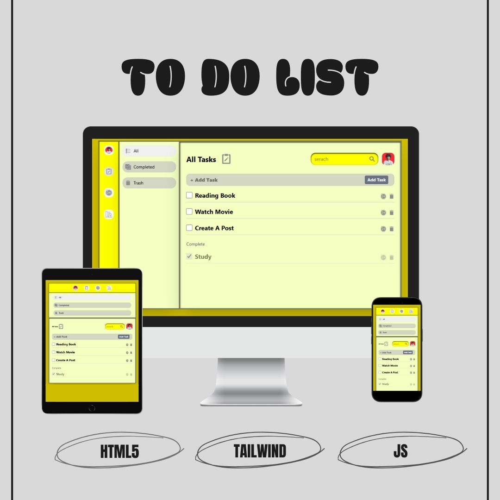
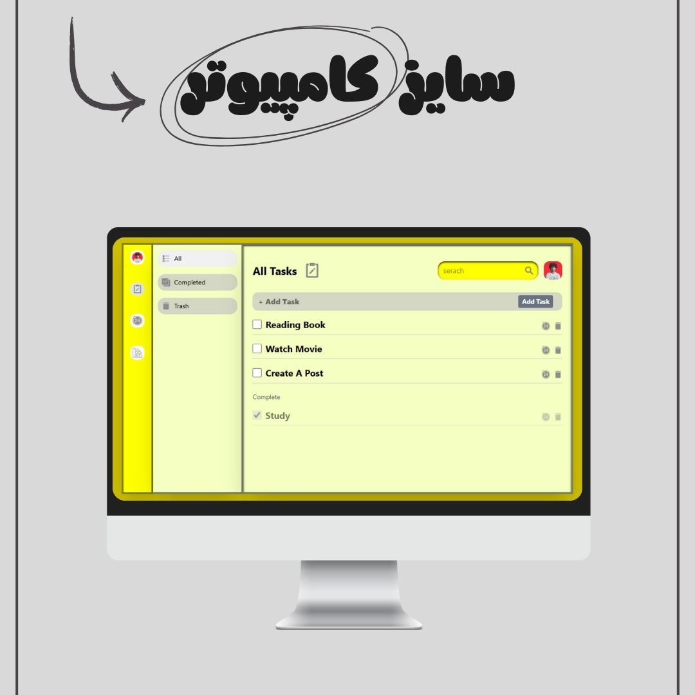
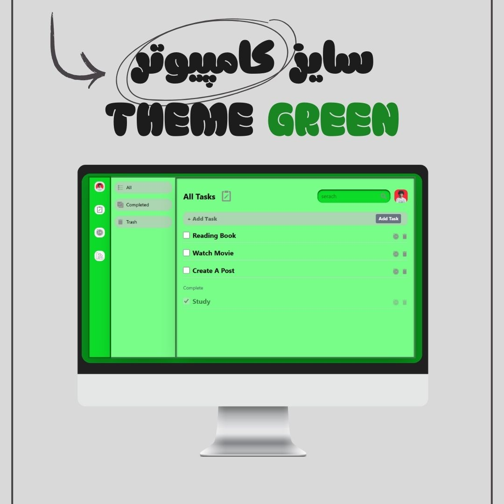
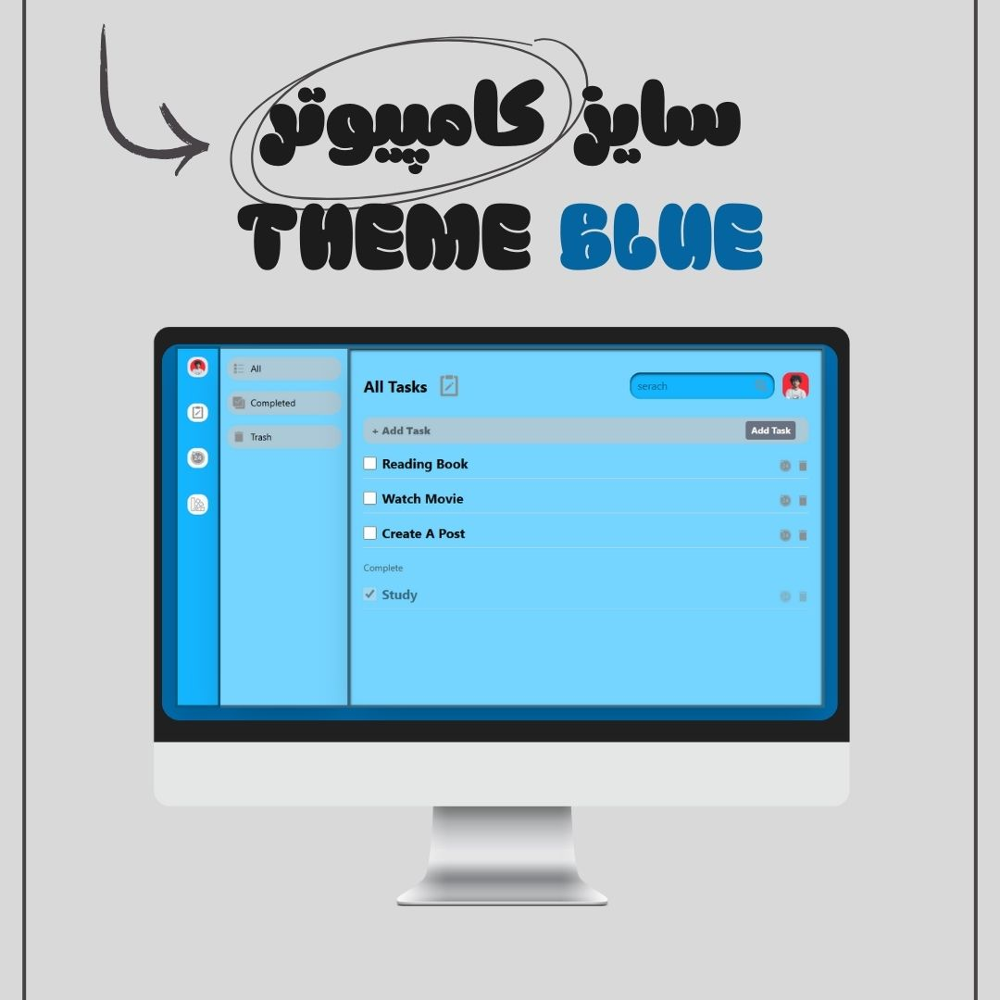
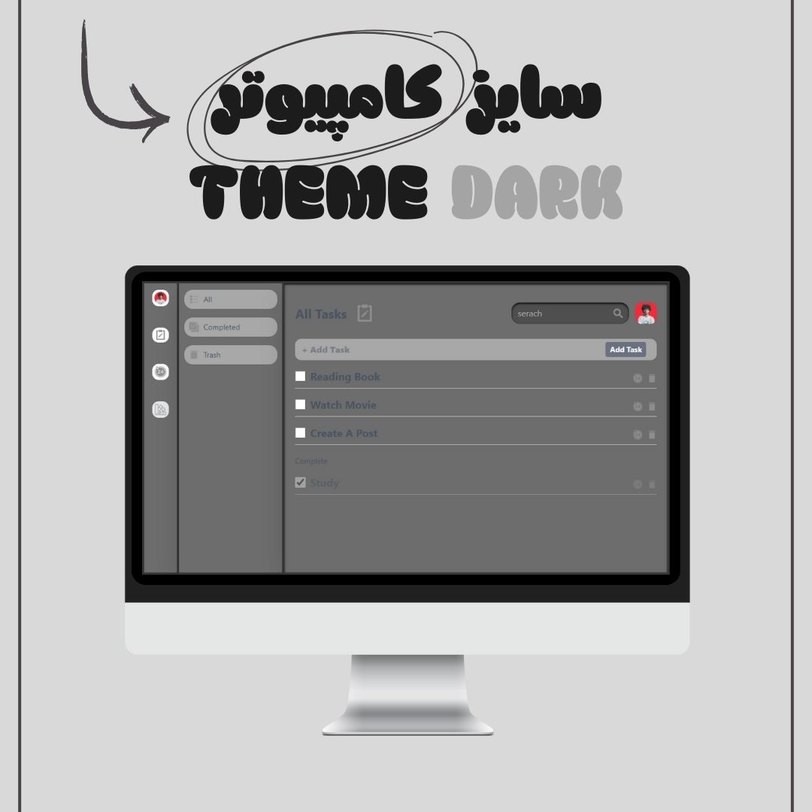
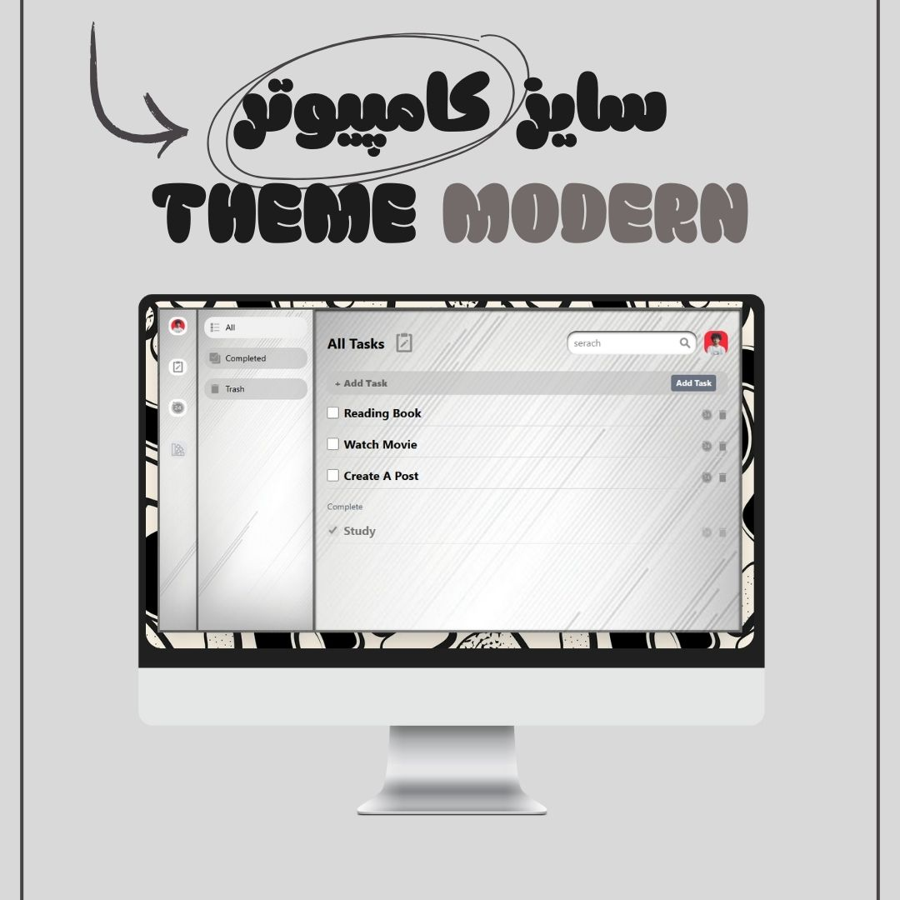
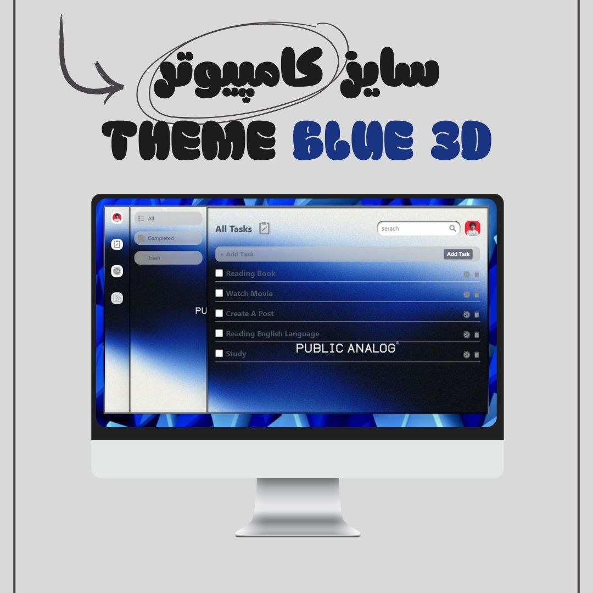
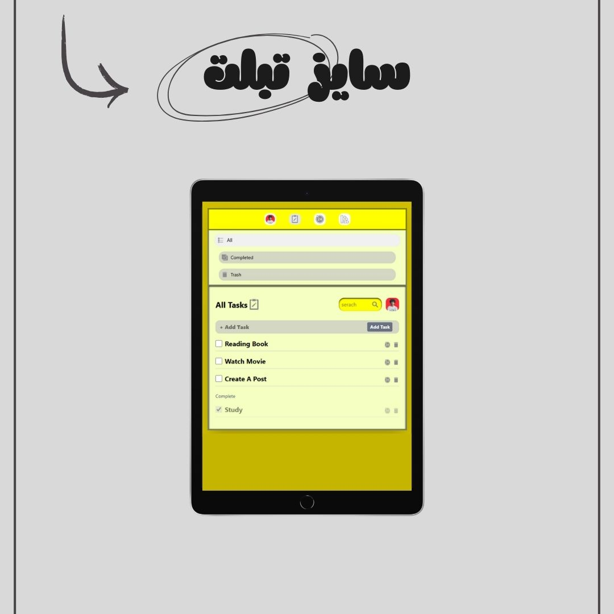
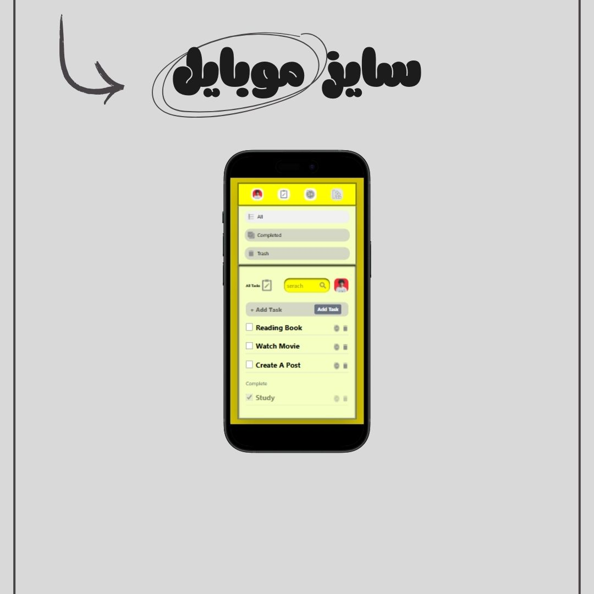

# ✅ Advanced To-Do List App – Task Manager with Themes & Smart Features

A fully responsive To-Do List application built with Tailwind CSS and Vanilla JavaScript, packed with modern features to make task management simple and fun.

این پروژه یک اپلیکیشن مدیریت کارها (To-Do List) است که با Tailwind CSS و JavaScript ساخته شده و امکانات حرفه‌ای برای مدیریت کامل تسک‌ها ارائه می‌دهد.

---

## 📅 Created On | تاریخ ساخت

september 13, 2025 | 22 شهریور ۲۰۲۵

## 🔗 Live Demo

[👉 Try it here](https://parsa-farshah.github.io/ToDoList/) <!-- (لینک دمو واقعی رو بذار اینجا) -->

---

## ✨ Key Features | ویژگی‌ها

- ✅ Complete & Trash Pages – finished tasks move to "Completed" & deleted tasks move to "Trash"
- 📅 Daily Tasks Section – add & manage daily goals separately
- 🎨 Multiple Themes – switch between different UI themes easily
- 📱 Fully Responsive – optimized for desktop, tablet, and mobile
- ⚡ Smooth Animations – clean transitions between task states
- 🧩 Vanilla JavaScript – no frameworks, lightweight & fast

---

## 🛠️ Technologies Used | تکنولوژی‌ها

- HTML5 – Semantic structure
- CSS3 + Tailwind CSS – Responsive & modern UI
- JavaScript (Vanilla) – Dynamic task handling & theme switching

---

## 👨‍💻 Developed By | توسعه‌دهنده

Parsa Dehghan Pour Farashah

## 🔧 Project Mentor | مربی پروژه

[@parsa_ghorbanian_web](https://www.instagram.com/parsa_ghorbanian_web)

---

## 📲 Connect with Me | ارتباط با من

- 📸 Instagram: [@parsa_dehghanpour_dv](https://www.instagram.com/parsa_dehghanpour_dv)
- 💼 LinkedIn: [Parsa Dehghan Pour Farashah](https://linkedin.com/in/parsa-dehghan-pour-farashah-85ab04250)
- 💻 GitHub: [parsa-farshah](https://github.com/parsa-farshah)
- 📩 Email: parsafarashah2002@gmail.com
- 📺 YouTube: [@FrontEndFresh](https://www.youtube.com/@FrontEndFresh)
- 🖍 codePen : [parsa-dehghan-pour-farashah](https://codepen.io/parsa-dehghan)

---

## 📸 Project Screenshots | پیش‌نمایش پروژه

### 🌟 Overview

### 💻 Desktop View

### 💻 Desktop View

### 💻 Desktop View

### 💻 Desktop View

### 💻 Desktop View

### 💻 Desktop View

### 📱 Tablet View

### 📱 Mobile View

